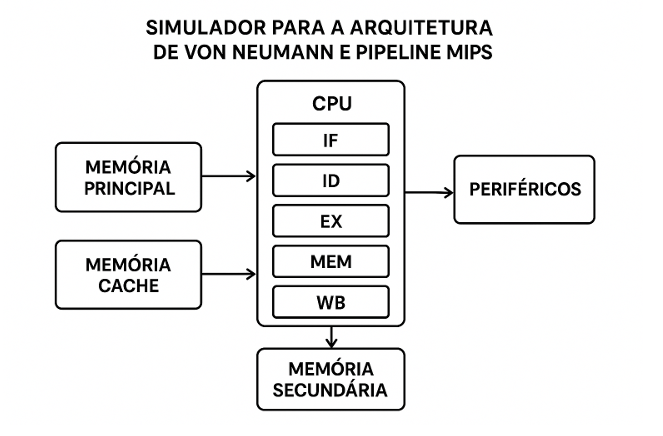
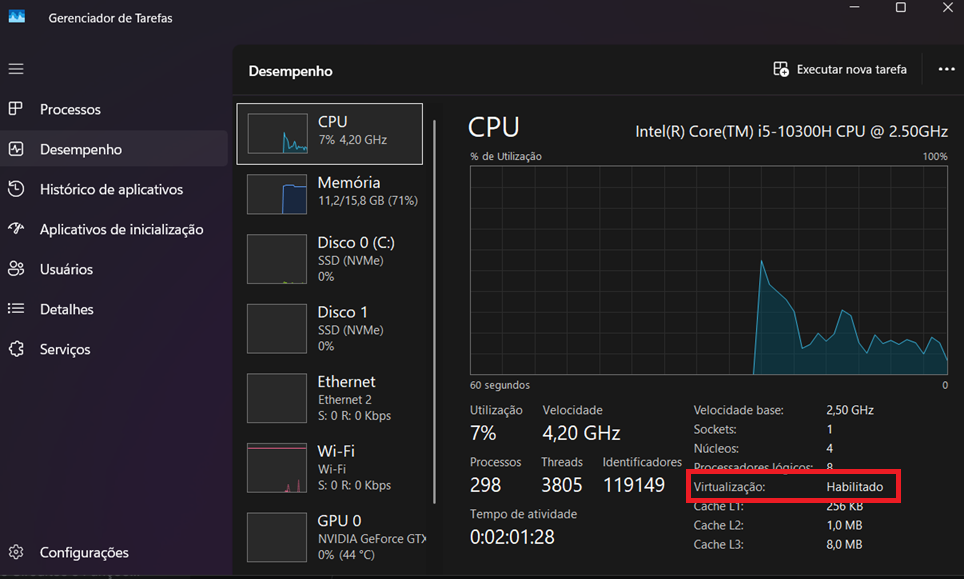
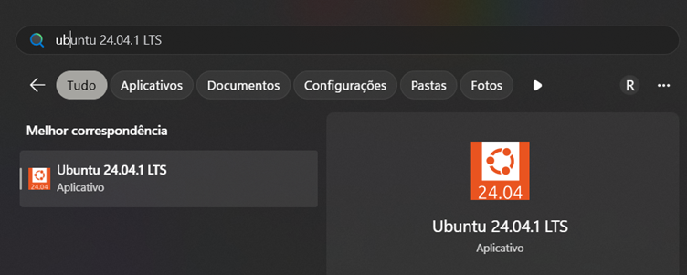
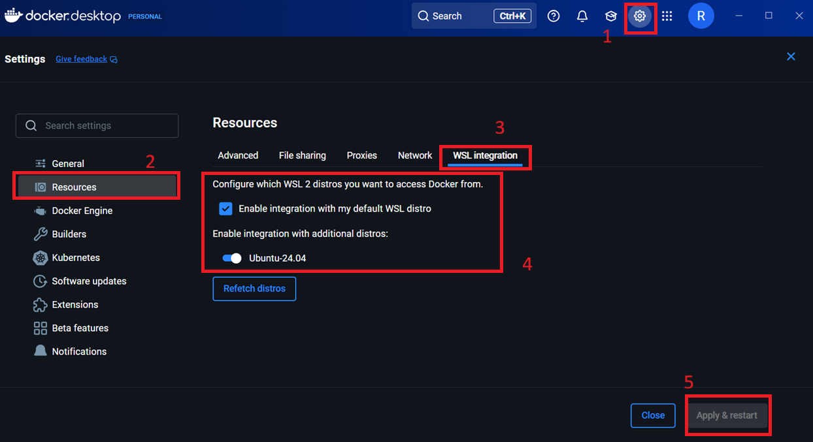

<p align="center"> 
  
</p>

<h1 align="center">
Simulador para a Arquitetura 

de Von Neumann e Pipeline MIPS
</h1>


<div align="justify">
  <p>Esse é um repositório voltado para a simulação computacional de uma arquitetura de Von Neumann que utiliza o pipeline MIPS, proposta como trabalho de aquecimento da disciplina de Sistemas Opercionais do CEFET-MG Campus V pelo professor Michel Pires da Silva em 2025.</p>
</div>

## 📖: Índice

- [Visão Geral](#visão-geral)
- [Organização do Repositório](#organização-do-repositorio)
    - [Arquivos da CPU](#arquivos-da-cpu)
    - [Arquivos das Memórias](#arquivos-das-memórias)
    - [Arquivos dos Periféricos e Dispositivos I/O](#arquivos-dos-periféricos)
- [Sobre a CPU](#sobre-a-cpu)
- [Sobre as Memórias](#sobre-as-memórias)
- [Sobre os Periféricos e I/O](#sobre-os-periféricos-e-i/o)
- [Configuração do WSL e Docker](#configuração-do-wsl-e-docker)
- [Colaboradores](#colaboradores)


## Visão Geral

<div align="justify">
<p>Segundo a proposta do trabalho, a arquitetura de Von Neumann, proposta por John von Neumann na década de 1940, constitui a base
conceitual dos sistemas computacionais modernos. Essa arquitetura caracteriza-se pelo uso de uma única memória compartilhada para armazenamento de dados e instruções, característica que origina o fenômeno conhecido como Von Neumann bottleneck. Essa limitação decorre do fato de que processador e memória disputam o mesmo barramento de comunicação, restringindo a taxa de transferência e consequentemente, comprometendo o desempenho do sistema.</p>

<p>Com o intuito de mitigar esse problema, a evolução da computação incorporou soluções fundamentadas na organização hierárquica da CPU, dos barramentos e da memória. Nesse contexto, a memória cache desempenha papel de relevância, atuando como intermediária entre a CPU e a memória principal. Por possuir elevada velocidade de acesso, ainda que com capacidade limitada, a cache armazena temporariamente dados e instruções frequentemente utilizados, reduzindo a latência e ampliando a eficiência global da execução. Além disso, avanços como barramentos de maior largura, mecanismos de acesso direto à memória (Direct Memory Access — DMA) e outras técnicas foram incorporados ao modelo clássico,a fim de atender às crescentes demandas por alto desempenho.</p>

<p>Esse trabalho foi baseado no seguinte diagrama proposto de arquitetura:</p>
</div>

<div align="center">



 </div

 Para a elaboração desse trabalho a turma foi dividida em 4 grupos:

 - **CPU**: grupo responsável por montar a simulação isolada da CPU usando a pipeline MIPS, junto do seu conjunto de instruções utilizado.
 - **Memórias**: grupo responsável por implementar a simulação das memórias principal, secundária e a memória cache dentro da CPU.
 - **Periféricos**: grupo responsável por implementar dispositivos de entrada/saída e componentes de gerenciamento de I/O, bem como implementar arquivos de entrada de programas a serem inseridos na memória e lidos pela CPU. 
 - **Suporte**: grupo responsável por integrar todos os sistemas anteriores, além de gerenciar o progresso do trabalho, documentar o projeto e oferecer suporte de desenvolvimento às outras equipes. 

 


## Organização do Repositório
Com base na definição da arquitetura, na divisão de tarefas entre toda a sala e na integração de todos os componentes, o repositório ficou organizado da seguinte forma:

...

Com base nos arquivos gerados, podemos definir propriamente em qual parte da arquitetura cada um deles pertence, como ficou definido no resumo a seguir:

### Arquivos da CPU
#### Unidade de Controle (UC):
- `CONTROL_UNIT.cpp`
- `CONTROL_UNIT.hpp`
#### PCB:
- `PCB.hpp`
- `pcb_loader.cpp`
- `pcb_loader.hpp`
#### Registradores:
- `HASH_REGISTER.hpp`
- `REGISTER.hpp`
- `REGISTER_BANK.cpp`
- `REGISTER_BANK.hpp`
#### Unidade Lógica e Aritmética (ULA):
- `ULA.cpp`
- `ULA.hpp`
- `ULA.o`


### Arquivos das Memórias
#### Memórias principal e secundária:
- `MAIN_MEMORY.hpp`
- `SECONDARY_MEMORY.hpp`


### Arquivos dos Periféricos
...


## Sobre a CPU

### `ULA.hpp/.cpp`:

<div align="justify">
<p>A Unidade Lógica Aritmética é o componente responsável por realizar as operações necessárias (sendo estas matemáticas e lógicas) para o entendimento da máquina acerca das instruções.</p>

<p>Esta é essencial para a estrutura e comportamento de toda máquina, visto que ela opera os números binários à baixo nível. Há-se também uma <i>flag</i> nomeada como <b>overflow</b>, que indica caso o resultado ultrapasse a capacidade de interpretação da ULA. Dentre as operações implementadas, temos:</p>
</div>


#### ADD:
* **Tipo:** Aritmética
* **Descrição:** Soma dois operandos e armazena o resultado. (com detecção de overflow signed)
#### SUB
* **Tipo:** Aritmética
* **Descrição:** Subtrai o segundo operando em relação ao primeiro e armazena o resultado. (com detecção de overflow signed)
#### MUL
* **Tipo:** Aritmética
* **Descrição:** Multiplica dois operandos e armazena o resultado. (com detecção de overflow signed)
#### DIV
* **Tipo:** Aritmética
* **Descrição:** Dividi o primeiro operando em relação ao segundo e armazena o resultado. (com detecção de overflow signed, trata divisão por zero).
#### AND_OP
* **Tipo:** Lógica
* **Descrição:** Compara os dois operandos como uma porta lógica "AND" e armazena o resultado. (tratando ambos como usigned)
#### BEQ (Branch if Equal)
* **Tipo:** Lógica
* **Descrição:** Compara os dois operandos, resulta 1 se forem iguais e 0 caso contrário. 
#### BNE (Branch if Not Equal)
* **Tipo:** Lógica
* **Descrição:** Compara os dois operandos, resulta 1 se forem distintos e 0 caso contrário.
#### BLT (Branch if Less Than)
* **Tipo:** Lógica
* **Descrição:** Compara os dois operandos, resulta 1 se o primeiro operando for **menor** que o segundo, e 0 caso contrário.  (signed)
#### BGT (Branch if Greater Than)
* **Tipo:** Lógica
* **Descrição:** Compara os dois operandos, resulta 1 se o primeiro operando for **maior** que o segundo, e 0 caso contrário. (signed)
#### BGTI (Branch if Greater Than Immediate)
* **Tipo:** Lógica
* **Descrição:** Compara os dois operandos, resulta 1 se o primeiro operando for **maior** que o segundo, e 0 caso contrário. (Convenção do operando B [segundo] conter o imediato)
#### BLTI (Branch if Less Than Immediate)
* **Tipo:** Lógica
* **Descrição:** Compara os dois operandos, resulta 1 se o primeiro operando for **menor** que o segundo, e 0 caso contrário. (Convenção do operando B [segundo] conter o imediato)
* OBS: Todas operações do tipo Branch realizam **salto** de instrução;
#### LW (Load Word)
- **Tipo:** Dados
- **Descrição:** Carrega um valor da memória para um registrador
#### LA (Load Address)
- **Tipo:** Dados
- **Descrição:** Carrega um endereço da memória para um registrador
#### ST (Store)
- **Tipo:** Dados
- **Descrição:** Armazena um valor de um registrador para uma posição na memória.
### Atributos:

- `A`, `B`: Entradas A e B da ALU, que recebem operandos de 32 bits (através do uint_32).
- `result`: Resultado da operação (32 bits signed).
- `overflow`: Flag de overflow.
- `op`: Operação a ser realizada.
### Funções:
- `calculate()`: Executa a operação especificada.
- `execute():` Recebe os operandos e a operação para realizar o cálculo.

## `REGISTER.hpp/.cpp`:

<div align="justify">
<p>Unidade individual de armazenamento, usado de diversas maneiras como para armazenas dados temporários utilizados pela ULA, endereços de memórias para busca dentro da mesma e informações de controle para funcionamento completo da estrutura.</p>
</div>

O registrador possui:
- `value:` o valor do registrador, representado por um uint_32 (uma palavra de 32 bits), e inicializado em 0 por convenção através do construtor.
- `write():` responsável por escrever um novo valor no registrador. (OBS: sem proteção de escritad no R0)
 - `read():` responsável por retornar o valor atual do registrador, utiliza-se *const* para evitar a modificação do registrador.
 - `reverse_read():` responsável por retornar o valor com os bytes invertidos (chamado *endianness swap*). 


## `HASH_REGISTER.hpp/.cpp`:

<div align="justify">
<p>Estes arquivos são responsáveis por fazer o mapeamento dos registradores utilizados pela Unidade de Controle. Tem-se a implementação completa e correta da especificação MIPS R3000/R4000:</p>

- R0 (zero): Sempre contém 0 (hardwired)
- R1 (at): Assembler temporário
- R2-R3 (v0-v1): Resultados de Função
- R4-R7 (a0-a3): Argumentos de Função
- R8-R15 (t0-t7): Registradores Temporários
- R16-R23 (s0-s7): Registradores de Salvamento
- R24-R25 (t8-t9): Mais Registradores Temporários
- R26-R27 (k0-k1): Reservado para o Kernel
- R28-R31 (gp, sp, fp, ra): Propósitos Especiais
	- R0 -> R31: Registradores de **propósito geral**
	- Registradores especiais: **PC, MAR, IR, HI, LO, SR, EPC, CR**

Utilizou-se std::unordered_map (com custo de O(1) amortizado) para melhoria da performance de acesso aos registradores. E uma implementação de auxílio para acessos mais rápidos e frequentes.

Todo registrador possui um **nome, tipo, uma variável de disponibilidade e uma descrição**.  

Tem-se na classe de `RegisterMapper`, mapas bidirecionais para uma performance otimizada de busca. Sendo eles de *binário para nome/nome para binário e um com os metadados dos registradores.*


## `REGISTER_BANK(.hpp e .cpp)`:

<div align="justify">
<p>O banco de registradores é, na teoria, **a memória mais rápida da CPU**. Ele funciona como uma "mesa de trabalho" para o processador, guardando os dados que estão sendo usados no momento, como o resultado de uma soma ou o endereço da próxima instrução.</p>

<p>Na prática, aqui no nosso código, o REGISTER_BANK é uma **classe que agrupa todos os registradores do MIPS como objetos individuais**. A ideia é que, em vez de acessar um registrador por um número (como o registrador 16), a Control Unit pode simplesmente pedir pelo nome ("s0"), usando os mapas que a gente criou. Isso deixa o código do resto do grupo muito mais fácil de ler e entender.</p>

**Registradores de uso específico:** 
- `REGISTER pc, mar, cr, epc, sr, hi, lo, ir;`

**Registradores de uso geral:** 
- `REGISTER zero, at; REGISTER v0, v1; REGISTER a0, a1, a2, a3; REGISTER t0, t1, t2, t3, t4, t5, t6, t7, t8, t9; REGISTER s0, s1, s2, s3, s4, s5, s6, s7; REGISTER k0, k1; REGISTER gp, sp, fp, ra;`
## Funções:
- `REGISTER_BANK()`: Ele preenche os mapas que associam os nomes dos registradores (ex: "t0")  às suas funções de leitura e escrita. É aqui que a mágica do acesso por nome acontece.
- `readRegister()`: Lê um registrador usando o nome como string. Lança um erro se o nome for inválido.
- `writeRegister()`: Escreve em um registrador usando o nome. A proteção do registrador "zero" é garantida aqui.
- `reset()`: Zera todos os registradores. Serve para limpar o estado da CPU entre processos.
- `print_registers()`: Função de ajuda para debug. Imprime o valor de todos os registradores de forma organizada na tela.

## `CONTROL_UNIT.hpp/.cpp`:

<div align="justify">
<p>A Unidade de Controle é uma das partes mais cruciais da CPU que coordena e gerencia a execução de instruções no processador. Ela atua como o centro pensativo da CPU, determinando quais operações devem ser realizadas, em qual ordem e com quais dados. As instruções citadas no ciclo da CPU e da Pipeline são definidas e realizadas aqui, na ordem necessária e solicitada pelo sistema.</p>

<p>Lê instruções da memória, decodifica quais registradores e imediatos usar, manda as operações para a ULA (ALU), faz acesso à memória (load/store) e gera pedidos de I/O (print). Tudo isso dividido em 5 etapas (pipeline): IF, ID, EX, MEM, WB.</p>

### Helpers:
- `binaryStringToUint(...)`  -> transforma uma string de '0'/'1' em número.
- `signExtend16(...)`  -> transforma um imediato de 16 bits em 32 bits preservando o sinal (two's complement).

### Utilitários para extrair campos da instrução de 32 bits:
- `Get_immediate(...)`  -> pega os 16 bits de imediato.
- `Pick_Code_Register_Load(...)`  -> pega o campo rt (bits 11..15).
- `Get_destination_Register(...)` -> pega rd (bits 16..20).
- `Get_target_Register(...)`  -> pega rt (bits 11..15).
- `Get_source_Register(...) `  -> pega rs (bits 6..10).

O Ciclo implementado no MIPS (através do pseudoparalelismo de pipeline) há-se descrito a seguir:
- `void Fetch(ControlContext &context):` busca instrução da memória;
- `void Decode(REGISTER_BANK &registers, Instruction_Data &data):`  decodifica campos;
- `void Execute_Aritmetic_Operation(REGISTER_BANK &registers, Instruction_Data &d):` usa ULA para ALU-ops;
- `void Execute_Operation(Instruction_Data &data, ControlContext &context):`  branches /saltos / syscalls (chamadas do sistema);
- `void Execute_Loop_Operation(REGISTER_BANK &registers, Instruction_Data &d,int &counter, int &counterForEnd, bool &endProgram, MainMemory &ram, PCB &process):`Loop principal;
- `void Execute(Instruction_Data &data, ControlContext &context):`  dispatcher de execução;
- `void Memory_Acess(Instruction_Data &data, ControlContext &context):` LW / SW (depende de MainMemory);
- `void Write_Back(Instruction_Data &data, ControlContext &context);`  grava resultado no banco de registradores;
### Acerca da Execução
- **Identificação de instrução:**
	- `Identificacao_instrucao(...)` -> lê os 6 bits do opcode e tenta retornar uma string com o nome da instrução ("ADD", "LW", "J", ...). *OBS:* o mapeamento está simplificado; R-type com opcode 000000 tenta usar o campo 'funct' para inferir ADD/SUB/MULT/DIV.
  - **Estágios do pipeline (explicação direta):**
      * Fetch(context)   -> busca a instrução na memória usando o PC e escreve em IR. Também detecta um sentinel de fim de programa.
      * Decode(regs, d)  -> lê a IR, identifica o mnemonic e preenche os campo em Instruction_Data (registradores, imediato, etc).   Faz sign-extend dos imediatos quando necessário.
      * Execute(...)     -> dispatcher que decide qual execução fazer:
		   - Execute_Aritmetic_Operation(...) para ADD/SUB/...
		   - Execute_Loop_Operation(...) para BEQ/J/BLT/...
		   - Execute_Operation(...) para PRINT / I/O
	* Memory_Acess(...)-> realiza LW, SW, LA, LI e leitura para PRINT de endereços de memória.
      * Write_Back(...)  -> grava na memória em caso de SW (ou outros writes se adicionados).


## Sobre as Memórias
Neste módulo da memória do simulador está dividido em três componentes principais:

- **Memória Principal (RAM)** — implementada em [`MAIN_MEMORY.hpp`](src/memory/MAIN_MEMORY.hpp) e [`MAIN_MEMORY.cpp`](src/memory/MAIN_MEMORY.cpp).  
- **Memória Secundária (disco/armazenamento permanente)** — implementada em [`SECONDARY_MEMORY.hpp`](src/memory/SECONDARY_MEMORY.hpp) e [`SECONDARY_MEMORY.cpp`](src/memory/SECONDARY_MEMORY.cpp).  
- **Gerenciador de Memória (MemoryManager)** — interface que unifica acesso às duas memórias e faz a tradução de endereços lógicos para cada espaço. Implementado em [`MemoryManager.hpp`](src/memory/MemoryManager.hpp) e [`MemoryManager.cpp`](src/memory/MemoryManager.cpp).

---

### MAIN_MEMORY
**Papel:** simular a memória principal (RAM) como um vetor linear de palavras (`vector<uint32_t>`).

**Comportamento principal (funções):**
- **Construtor** — [`MAIN_MEMORY::MAIN_MEMORY`](src/memory/MAIN_MEMORY.cpp#L3) recebe o tamanho desejado, ajusta pelo `MAX_MEMORY_SIZE` e inicializa com `MEMORY_ACCESS_ERROR`.  
- [`isEmpty()`](src/memory/MAIN_MEMORY.cpp#L18) — percorre o vetor e retorna `true` se todas as posições forem `0`.  
- [`notFull()`](src/memory/MAIN_MEMORY.cpp#L25) — verifica se existe alguma posição igual a `0` (há espaço livre).  
- [`ReadMem(uint32_t address)`](src/memory/MAIN_MEMORY.cpp#L32) — retorna o conteúdo em `address` se válido; senão `MEMORY_ACCESS_ERROR`.  
- [`WriteMem(uint32_t address, uint32_t data)`](src/memory/MAIN_MEMORY.cpp#L39) — escreve `data` se `address` válido; caso contrário retorna `MEMORY_ACCESS_ERROR`.  
- [`DeleteData(uint32_t address)`](src/memory/MAIN_MEMORY.cpp#L49) — devolve o valor salvo e marca a célula com `MEMORY_ACCESS_ERROR`.

A RAM é representada por um `vector<uint32_t> ram` redimensionado para `size`. Inicialmente todas as posições são preenchidas com `MEMORY_ACCESS_ERROR`.  

---

### SECONDARY_MEMORY
**Papel:** simular a memória secundária (disco) como uma estrutura 2D (matriz).

**Comportamento principal (funções):**
- **Construtor** — [`SECONDARY_MEMORY::SECONDARY_MEMORY`](src/memory/SECONDARY_MEMORY.cpp#L3) limita o tamanho a `MAX_SECONDARY_MEMORY_SIZE`, calcula `rowSize` e inicializa `storage` com `MEMORY_ACCESS_ERROR`.  
- [`isEmpty()`](src/memory/SECONDARY_MEMORY.cpp#L19) — percorre todas as células e retorna `true` se todas forem `0`.  
- [`notFull()`](src/memory/SECONDARY_MEMORY.cpp#L27) — retorna `true` se houver alguma célula igual a `0`.  
- [`ReadMem(uint32_t address)`](src/memory/SECONDARY_MEMORY.cpp#L45) — converte `address` em `(row, col)` e retorna o conteúdo se válido; senão `MEMORY_ACCESS_ERROR`.  
- [`WriteMem(uint32_t address, uint32_t data)`](src/memory/SECONDARY_MEMORY.cpp#L52) — escreve `data` na célula se válido; senão `MEMORY_ACCESS_ERROR`.  
- [`DeleteData(uint32_t address)`](src/memory/SECONDARY_MEMORY.cpp#L62) — devolve o valor e marca a célula com `MEMORY_ACCESS_ERROR`.

A implementação usa uma **matriz quadrada** baseada em `sqrt(MAX_SECONDARY_MEMORY_SIZE)`.  
Para converter um endereço linear em coordenadas da matriz, são usados os métodos  
[`getRow(uint32_t address)`](src/memory/SECONDARY_MEMORY.cpp#L35), que retorna a linha (`address / rowSize`),  
e [`getCol(uint32_t address)`](src/memory/SECONDARY_MEMORY.cpp#L40), que retorna a coluna (`address % rowSize`).  
Esses métodos garantem que cada posição linear seja mapeada corretamente dentro da estrutura 2D da memória secundária.

<!-- 
---
### MemoryManager
**Papel:** camada de abstração que unifica leituras e escritas.

.......... -->

---

### Comportamento de erro e marcação de células
- Em operações inválidas (endereço fora do limite) as funções retornam `MEMORY_ACCESS_ERROR`.  
- Em deleções bem-sucedidas, a célula é marcada com `MEMORY_ACCESS_ERROR`.


## Sobre os Periféricos e I/O
### Estrutura dos Arquivos

* `IOManager.h`: Arquivo de cabeçalho da classe `IOManager`. Define a interface pública e os membros privados.
* `IOManager.cpp`: Arquivo de implementação da classe `IOManager`. Contém toda a lógica de funcionamento do gerenciador.
* `shared_structs.h`: Define estruturas de dados e enums (`PCB`, `IORequest`, `State`) que são compartilhados entre o `IOManager` e outros módulos.
* `main.cpp`: **Arquivo de simulação e exemplo de uso.** Ele cria um ambiente com processos e um escalonador para demonstrar a interação com o `IOManager`.

### Arquitetura do Projeto

O projeto do I/O é dividido em duas partes principais:

1.  **O Módulo `IOManager`**: É o núcleo deste trabalho. Sua responsabilidade agora é dupla:
    * **Simular Dispositivos**: Ele simula hardware (como impressora e disco) que, de forma independente, solicitam operações de I/O.
    * **Gerenciar Processos**: Ele mantém uma fila de processos que estão bloqueados esperando por I/O e os atribui aos dispositivos que se tornam ativos. Ele gera as requisições de I/O internamente.

2.  **O Ambiente de Simulação (`main.cpp`)**: Este código **não faz parte** do módulo `IOManager`. Ele atua como um "cliente" que utiliza o gerenciador, simulando:
    * A criação de Processos (PCBs).
    * Um escalonador de CPU (Round-Robin simples).
    * A decisão de um processo de solicitar uma operação de I/O, momento em que ele se "registra" no `IOManager` e fica bloqueado.

### Métodos Principais do `IOManager.cpp`

#### 1. `void IOManager::registerProcessWaitingForIO(PCB* process)`

Este é o **novo ponto de entrada** do `IOManager`. É a única função pública usada por sistemas externos para interagir com o gerenciador.

* **Responsabilidade**: Adicionar de forma segura um processo que entrou em estado `Blocked` a uma lista de espera interna.
* **Funcionamento**:
    1.  Recebe um ponteiro para o PCB do processo que precisa de I/O.
    2.  Utiliza um `std::lock_guard<std::mutex>` para bloquear o acesso à lista `waiting_processes` e evitar condições de corrida.
    3.  Adiciona o processo à lista de espera.

#### 2. `void IOManager::managerLoop()`

É uma função privada que executa em um loop infinito dentro de sua própria thread, representando o ciclo de vida do gerenciador. Sua lógica foi expandida e agora opera em três etapas principais a cada iteração:

* **Responsabilidade**: Simular dispositivos, combinar processos em espera com dispositivos ativos, criar requisições de I/O e processá-las.
* **Funcionamento**:
    1.  **Etapa 1: Simulação de Dispositivos**
        * De forma aleatória, o loop pode alterar o estado de um dos dispositivos (ex: `printer_requesting`) de `false` para `true`. Isso simula um periférico que agora precisa de serviço, representando o "estado 1" que foi solicitado.

    2.  **Etapa 2: Verificação e Criação de Requisições**
        * O gerenciador verifica duas condições simultaneamente: se há algum dispositivo com estado `true` E se há algum processo na `waiting_processes`.
        * Se ambas forem verdadeiras, ele "combina" os dois:
            * Pega o primeiro processo da fila de espera.
            * Cria uma estrutura `IORequest` específica para o dispositivo ativo (ex: `operation = "print_job"`).
            * **Atribui um custo aleatório de 1 a 3** à requisição.
            * Muda o estado do dispositivo de volta para `false` (ocupado ou atendido).
            * Adiciona a requisição recém-criada à fila de processamento interna.

    3.  **Etapa 3: Processamento da Requisição**
        * Se a fila de processamento não estiver vazia, a primeira requisição é retirada.
        * Simula o custo em tempo da operação usando `std::this_thread::sleep_for`.
        * Grava logs no console e nos arquivos `result.dat` e `output.dat`.
        * Ao final, **libera o processo** que estava bloqueado, alterando seu estado de volta para `State::Ready`, permitindo que ele volte a ser escalonado pela CPU.

### Saídas Geradas

* `result.dat`: Um arquivo de log em formato de texto, que descreve cada operação de I/O concluída.
* `output.dat`: Um arquivo de dados em formato CSV (`id,operação,duração`) para fácil importação e análise.


## Configuração do WSL e Docker

### Instalando e configurando o Dev Containers no Windows

Antes de começar, verifique se seu sistema atende a estes dois requisitos essenciais:

1.  **Versão do Windows:** Você precisa do Windows 10 (versão 2004 ou mais recente) ou qualquer versão do Windows 11.

2.  **Virtualização Habilitada na BIOS/UEFI:** O WSL 2 precisa que a virtualização de hardware esteja ativa.

     **Como verificar:**

        1.  Abra o **Gerenciador de Tarefas** (`Ctrl + Shift + Esc`).

        2.  Vá para a aba **Desempenho** e clique em **CPU**.

        3.  No canto inferior direito, procure por **Virtualização**. Deve estar **Habilitado**.




  **Se estiver desabilitado, você precisará reiniciar o computador, entrar na BIOS/UEFI (geralmente pressionando F2, F10 ou Del durante a inicialização) e ativar a opção (pode ter nomes como "Intel VT-x", "AMD-V" ou "SVM Mode").**

---
### Passo 1: Instalar o WSL (Subsistema do Windows para Linux)

1.  **Abra o PowerShell como Administrador:**
    * Clique com botão direito no Menu Iniciar, clique em `Windows PowerShell (Admin)` .

2.  **Execute o Comando de Instalação:**

    * Na janela do PowerShell, digite o seguinte comando e pressione Enter:
```powershell
 wsl --install
```

3.  **Reinicie o Computador:**

    * Após o comando terminar, ele pedirá que você reinicie. Salve seus trabalhos e reinicie.

4.  **Instale o Ubuntu:**

```powershell
  wsl --install -d Ubuntu
```
  

5.  **Configure o Ubuntu:**



    Após a instalação procure por Ubuntu no menu iniciar (Pode ser que não seja a mesma versão da image) e clique. Você precisará  configurar rapidamente, será pedido para você criar um **nome de usuário** e uma **senha** para o seu ambiente Linux. 

---
### ⚠️ O que fazer se o comando `wsl --install` falhar? (O Método Manual)


> Em versões mais antigas do Windows 10 ou em casos específicos, o comando único pode não funcionar. Se isso acontecer, você pode seguir o método antigo, que consiste em habilitar as funcionalidades manualmente.

  

**Execute os seguintes comandos no PowerShell como Administrador, um de cada vez:**

  

1.  **Habilitar a funcionalidade "Subsistema do Windows para Linux":**

```powershell
dism.exe /online /enable-feature /featurename:Microsoft-Windows-Subsystem-Linux /all /norestart     
```

  

2.  **Habilitar a funcionalidade "Plataforma de Máquina Virtual":**
```powershell
dism.exe /online /enable-feature /featurename:VirtualMachinePlatform /all /norestart
```

3.  **Reinicie o computador.**

4.  **Baixe e instale o pacote de atualização do kernel do Linux:**

   - [Clique aqui para baixar o pacote do site da Microsoft](https://wslstorestorage.blob.core.windows.net/wslblob/wsl_update_x64.msi). Execute o instalador baixado.


5.  **Definir o WSL 2 como padrão:**

```powershell
wsl --set-default-version 2
```

6.  **Instale o Ubuntu:**

```powershell
wsl --install -d Ubuntu
```
  
7.  **Configure o Ubuntu:**

    Após a instalação procure por Ubuntu no menu iniciar e clique. Você precisará  configurar rapidamente, será pedido para você criar um **nome de usuário** e uma **senha** para o seu ambiente Linux.
    
---

### Passo 2: Instalar o Docker Desktop
  1.  **Baixe o Instalador:**

  - Vá para o site oficial: [**docker.com/products/docker-desktop/**](https://www.docker.com/products/docker-desktop/)

2.  **Execute o Instalador:**

    - Durante a instalação, certifique-se de que a opção **"Use WSL 2 instead of Hyper-V (recommended)"** esteja marcada.

3.  **Inicie e Configure o Docker Desktop:**

    - Após a instalação, inicie o Docker Desktop.

    - Faça um registro rápido na plataforma docker hub

    - Vá em **Settings > Resources > WSL Integration**.

    - Certifique-se de que o interruptor para a sua distribuição ("Ubuntu") esteja **ligado**.

    - Clique em **"Apply & Restart"**.



---
  
### Passo 3: Instalar e Configurar o Visual Studio Code

1.  **Instale a Extensão Dev Containers:**

    - No VS Code, vá para a aba de **Extensões** (`Ctrl + Shift + X`).

    - Procure por `Dev Containers` e instale a extensão da Microsoft.
  
---
### Passo 4: Testando Tudo!

1.  Clone este repositório.

2.  Clique em **"Reopen in Container"** quando o aviso aparecer, aguarde pois estárá sendo feito o download de todas as dependenciais necessárias do container. 

3. Abra o terminal do vscode e digite os seguintes comandos:
- `make teste`
 
Certifique-se de fornecer exemplos de comandos ou scripts necessários para executar o projeto corretamente.


## Colaboradores

### EQUIPE CPU:
- João Pedro Rodrigues Silva ([jottynha](https://github.com/Jottynha))
- Anderson Rodrigues dos Santos ([anderrsantos](https://github.com/anderrsantos)) 
- Pedro Augusto Gontijo Moura ([PedroAugusto08](https://github.com/PedroAugusto08))
- Henrique de Freitas Araújo ([ak4ai](https://github.com/ak4ai)) 
- Álvaro Augusto José Silva ([alvaroajs](https://github.com/alvaroajs))
- Eduardo da Silva Torres Grillo ([EduardoGrillo](https://github.com/EduardoGrillo))
- Jader Oliveira Silva ([0livas](https://github.com/0livas))

### EQUIPE MEMÓRIAS:
- Guilherme Alvarenga de Azevedo ([alvarengazv](https://github.com/alvarengazv))
- Maria Eduarda Teixeira Souza ([dudatsouza](https://github.com/dudatsouza))
- Joaquim Cezar Santana da Cruz ([JoaquimCruz](https://github.com/JoaquimCruz))
- Élcio Costa Amorim Neto ([elcioam](https://github.com/elcioam))
- João Paulo da Cunha Faria ([joaopaulocunhafaria](https://github.com/0livjoaopaulocunhafariaas))
- Lucas Cerqueira Portela ([lucasporteladev](https://github.com/lucasporteladev))

### EQUIPE PERIFÉRICOS:
- Bruno Prado dos Santos ([bybrun0](https://github.com/bybrun0))
- ⁠Eduardo Henrique Queiroz Almeida ([edualmeidahr](https://github.com/edualmeidahr))
- ⁠João Francisco Teles da Silva ([joaofranciscoteles](https://github.com/joaofranciscoteles))
- ⁠Maíra Beatriz de Almeida Lacerda ([mairaallacerda](https://github.com/mairaallacerda))
- ⁠Sérgio Henrique Quedas Ramos ([serginnn](https://github.com/serginnn))

### EQUIPE SUPORTE:
- Samuel Silva Gomes ([samuelsilvg](https://github.com/samuelsilvg))
- Gabriel Vitor Silva ([gvs22](https://github.com/gvs22))
- Rafael Henrique Reis Costa ([RafaelReisyzx](https://github.com/RafaelReisyzx))
- Lívia Gonçalves ([livia-goncalves-01](https://github.com/livia-goncalves-01))
- Rafael Adolfo Silva Ferreira (radsfer](https://github.com/radsfer))
- Matheus Emanuel da Silva ([matheus-emanue123](https://github.com/matheus-emanue123))
- Deivy Rossi Teixeira de Melo ([deivyrossi](https://github.com/deivyrossi))